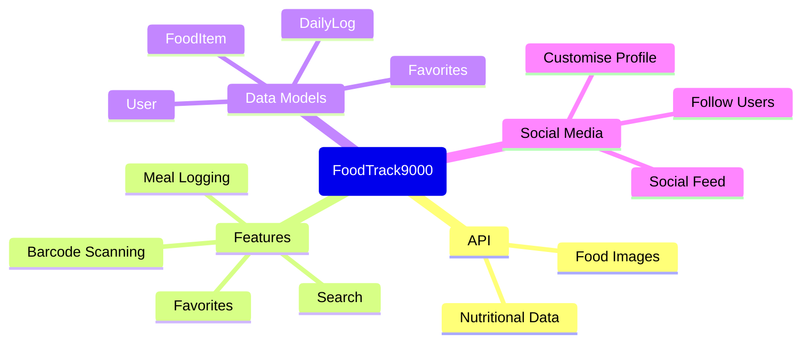

# Data Model Design

## Brainstorming



## Data Model - Initial Release
```
classDiagram
class FoodItem {
- String foodName
- String tagName
- String servingUnit
- Int servingQty
- String photoUrl
}

    class Favorite {
        - String favoriteId
        - String foodName
    }

  
```